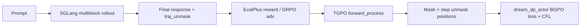

# 第五阶段：BGPO EvalPlus Direct 轨迹掩码 RL 方案

> 前置：[第四阶段 CFL 与 BGPO](./第四阶段D3LLM-Dream-Coder-Certainty-Forcing-Loss与BGPO.md)、[第二阶段 d3LLM×BGPO](./第二阶段D3LLM-Dream-Coder+BGPO兼容与debug内容.md)  
> 目标脚本：`recipe/dream/run_bgpo_dream_coder_evalplus_direct.sh`  
> 现象：全量 BGPO 训练后 HumanEval/MBPP pass@1 与 `models/finetune_d3LLM` 基线几乎一致，RL 信号未有效转化为评测能力提升。

---

## 1. 结论先行

| 问题 | 判断 |
|------|------|
| 「在 rollout 轨迹上掩码」是否值得做？ | **值得**。当前 BGPO 在 actor 更新阶段对 **整条 response 做随机 mask**（`_forward_process_bgpo`），与 SGLang **multiblock + entropy threshold** 的 rollout/评测路径 **不对齐**，是效果停滞的主因之一。 |
| 仓库里有没有可模仿实现？ | **有**。最接近的是 **`cj-grpo` + `reversed_traj_unmask_positions`**（按解码 unmask 顺序构造 mask）；步级 RL 可参考 **MDPO**；块级随机 mask 可参考 **EBPO**。 |
| 在 `evalplus_direct`（SGLang multiblock）上能否直接开？ | **不能一键切换**。当前 **`SGLangDreamRollout` 不导出解码轨迹**；需先补轨迹采集，再改 `forward_process` 或换 actor（仿 `llada_dp_actor_cj_grpo.py`）。 |
| 推荐路径 | **P0**：EBPO + 数据/奖励修正（低成本）；**P1**：Trajectory-BGPO（TGPO，仿 cj-grpo）；**P2**：MDPO 或多步轨迹 GRPO（成本高）。 |

---

## 2. 为何 `evalplus_direct` 训练几乎无效？

### 2.1 训练–推理–评测三重不对齐

```
Rollout / Val / EvalPlus 评测
  └─ SGLang FullAttnMultiBlock
       └─ block_length=32, entropy_threshold=0.5, 按置信度并行 unmask

Actor 更新（BGPO forward_process）
  └─ _forward_process_bgpo
       └─ 在整条 response 上均匀随机选 k 个 token 再 mask（与块、步、置信度无关）
```

- **随机 mask** 假设：任意 mask 子集上的 CE/ELBO 都能近似策略梯度；对 **AR** 模型尚可，对 **块扩散 + threshold 解码** 则偏离真实生成分布。
- **CFL**（脚本已开 `enable_cfl=True`）只在 **masked 且 pred==rollout token** 上压熵，仍建立在 **随机 mask 子集** 上，无法复现 multiblock「某步接受哪些 token」的结构。
- **GRPO 优势** 来自 pass/fail 标量；EvalPlus direct 用 **测试集 542 条** 训练时，通过样本比例低、方差大，`lr=5e-7` 下梯度易被噪声淹没。

### 2.2 与 naive SFT 失败机理同源

此前 `dream_fsdp_sft_trainer` 在 EvalPlus 上训 99 step 仍掉分，根因同样是 **随机 q_sample mask 的 CE** 与 **multiblock 评测** 不对齐。BGPO 虽用 rollout 作 label，但 **掩码方式** 仍与 SFT 同类，故「能力≈训练前」并不意外。

### 2.3 非根因但会加剧停滞的因素

- `enable_tpf_efficiency=False`：未用第三阶段 TPF 稠密塑形（可选叠加）。
- `cfl_gate_passed_only=True`：未过 EvalPlus 的 rollout 不算 CFL，有效 token 更少。
- 训练数据 = HumanEval+MBPP **canonical solution** parquet（direct 脚本注释为 overfit sanity）；若 rollout 质量差，RL 主要在强化「已有错误轨迹」。

---

## 3. 轨迹 RL / 轨迹掩码：要解决的问题

**定义（本文口径）**：在 policy 更新时，mask 模式来自 **同一次 rollout 的扩散解码轨迹**（每一步哪些位置从 `[MASK]` 变为真实 token），而不是独立采样的随机 mask。

**期望效果**：

1. Actor 在 **与推理一致的中间状态** \(x_t\) 上学习预测 \(x_{t+1}\) 或被 unmask 的 token。
2. ELBO / log-prob 估计覆盖 **真实 unmask 顺序**，减少 off-policy 偏差。
3. 与 d3LLM 蒸馏中的 **伪轨迹 + 窗口 mask** 同向，但 label 来自 **当前策略 rollout**（RL）而非固定 teacher。

---

## 4. 仓库内相关实现（可模仿程度）

### 4.1 cj-grpo + 反向 unmask 轨迹（★★★ 最贴近「轨迹掩码」）

| 组件 | 路径 | 作用 |
|------|------|------|
| 轨迹采集 | `verl/workers/rollout/generate.py`（`reversed_process_*`）、`cj_dream_rollout.py` / `fast_cj_dream_rollout.py` | `cj_diffusion_generate` 返回 `reversed_traj_unmask_positions`：形状 `(batch, steps, seq_len)`，每步 bool 表示 **本步新 unmask 的位置** |
| Actor | `verl/workers/actor/llada_dp_actor_cj_grpo.py` | **不用** `forward_process`；用轨迹逐步构造 `cur_perturbed_seq`，`cur_mask_indices = reversed_traj_unmask_positions[:, i, :]`，在 **本步实际 mask 位置** 上算 CE |
| Trainer | `dllm_ray_trainer.py`（`algorithm.name == "cj-grpo"`） | `response_masks` 取自轨迹张量 |

核心逻辑（节选意图）：

```python
# llada_dp_actor_cj_grpo.py — 第 i 步的 mask = 该步 unmask 位置（非随机）
cur_mask_indices = reversed_traj_unmask_positions[:, i, :]
next_perturbed_seq = torch.where(cur_mask_indices, seq, cur_perturbed_seq)
loss = cross_entropy(logits[cur_mask_indices], next_perturbed_seq[cur_mask_indices])
```

**局限**：依赖 **HF `cj_diffusion_generate`** 路径，与 **SGLang FullAttnMultiBlock** 的块并行、threshold、early_stop **未对齐**；Dream-Coder d3LLM 主线目前 **未** 走 cj rollout。

### 4.2 MDPO — 步级轨迹 RL（★★☆ 思想最接近「整条扩散轨迹」）

| 组件 | 路径 | 作用 |
|------|------|------|
| Rollout | `verl/workers/rollout/mdpo_dream_rollout.py` | `mdpo_diffusion_generate_dream` 保存每步 `intermediate_inputs` / `intermediate_results` / `intermediate_confidence` |
| Trainer | `dllm_ray_trainer.py`（`algorithm.name == "mdpo"`） | 按步算 reward、选 top-K 步、拼 `mdpo_step_input_ids` 训练 |
| Loss | `verl/trainer/ppo/mdpo_algos.py::compute_mdpo_policy_loss` | 带 `lambda_t`（mask 比例权重）的 PPO |

**局限**：`recipe/dream/run_mdpo_dream_7b_instruct.sh` 仅 **`engine=hf`**；timestep 调度与 d3LLM **multiblock+threshold** 不同；接入 EvalPlus direct 需 **新 rollout** 或大幅改 MDPO 生成器。

### 4.3 EBPO — 块级随机 mask（★★☆ 非轨迹，但块对齐）

| 组件 | 路径 | 作用 |
|------|------|------|
| Mask | `dllm_core_algos.py::_forward_process_ebpo` | 每个样本 **随机选一个 response block**，仅在该 block 内随机 mask |
| 脚本 | `recipe/sdar/run_ebpo_sdar_*.sh`（**无** Dream d3LLM 专用脚本） | `algorithm.name=ebpo`，其余与 BGPO 共用 `forward_process` 管线 |

**与轨迹 RL 关系**：仍 **随机**，但 mask 支持集限制在 **与 `block_length=32` 相同的一块**，是 multiblock 的 **弱对齐**；实现成本低，可作为 P0。

### 4.4 BGPO / VRPO — 当前 evalplus_direct 使用（★☆☆ 随机）

- `_forward_process_bgpo` / `_forward_process_vrpo`：response 上随机 mask 个数 \(k\)，与轨迹无关。
- `dream_dp_actor_bgpo.py` + `llada_dp_actor_bgpo.py`：MC 估计 ELBO 后 `compute_policy_loss_bgpo`。

### 4.5 d3LLM 蒸馏「伪轨迹」（★★☆ 外部参考，仓库仅文档提及）

- 实现位于 **d3LLM 仓库** `d3llm_dream_train.py`：teacher 生成轨迹 + 课程化 mask ratio。
- DARE [第四阶段文档 §7.2](./第四阶段D3LLM-Dream-Coder-Certainty-Forcing-Loss与BGPO.md) 记为 Phase 4b「伪轨迹辅助数据」，**未在 verl 实现**。

### 4.6 对照表

| 方法 | 掩码来源 | 与 multiblock 对齐 | Dream d3LLM + SGLang | 改 evalplus_direct 难度 |
|------|----------|-------------------|----------------------|-------------------------|
| BGPO（现况） | 随机 | 低 | 已用 | — |
| EBPO | 块内随机 | 中 | 未接 | **低**（改 `algorithm.name` + block_length） |
| cj-grpo | rollout 反向 unmask | 中（HF cj 路径） | 未接 | **中**（换 rollout + actor） |
| **TGPO（建议新名）** | SGLang multiblock 轨迹 | **高** | 需开发 | **中高** |
| MDPO | 逐步中间态 + 步级 RL | 低–中 | 仅 HF | **高** |
| 伪轨迹混合 | teacher 离线 | 高（若 teacher=multiblock） | 未接 | **很高** |

---

## 5. 技术可行性分析

### 5.1 Trajectory-BGPO（TGPO）— 推荐主方向

**思路**：保留 BGPO 的 GRPO 优势与 `compute_policy_loss_bgpo`，将 `forward_process` 替换为 **由 rollout 轨迹导出的 mask**（仿 cj-grpo，接口仍输出 `perturbed_seq` / `mask_indices` / `p_mask` 以最小侵入）。

**可行性：高**，理由：

1. **算法层**：cj-grpo 已证明「轨迹 mask + CE」可在 `dllm_fsdp_workers` 外闭环，无需改 PPO 公式。
2. **工程层**：`generate.py` 已在 LLaDA/Dream CJ 路径产出 `reversed_traj_unmask_positions`；multiblock 仅需在 **`dream_multiblock.py` 或 SGLang `FullAttnMultiBlock`** 每 accept 一步记录 `(step_idx, token_positions)`。
3. **Dream 特化**：`dream_dp_actor_bgpo.py` 的 logits shift 可复用；TGPO actor 可 **继承 BGPO actor**，仅改 mask 构造。

**主要风险**：

- 轨迹步数 \(T\) 大（`num_diffusion_steps=512`）→ 训练算力 \(\times T\)；需 **子采样步**（例如每 rollout 随机 1–4 步，或仅最后 \(K\) 个 block 步）。
- SGLang 与 HF 轨迹 **数值不一致** → 必须 **训练 rollout 与轨迹采集同引擎**（坚持 SGLang 则轨迹也来自 SGLang）。

### 5.2 在轨迹上「部分随机 mask」（轨迹 + MC）

可在某步轨迹状态 \(x_t\) 上，对 **本步已 unmask 集合** 或 **当前仍 mask 集合** 再做 BGPO 式随机子集 mask，用于 ELBO 方差归约（与现 `mc_num` / `n_l` 一致）。

- **可行性：中高**；与纯轨迹 mask 相比略损对齐，但实现更简单。
- **建议**：TGPO v1 用 **纯轨迹 mask**；v2 再加 MC 子采样。

### 5.3 MDPO 移植到 multiblock

- **可行性：中**；需 multiblock 版 `intermediate_*` 与步级 reward（代码执行仍只在终态）。
- **收益**：对 **解码过程** 直接 RL，而不只终态 pass/fail。
- **成本**：新 algorithm 分支 + Dream actor + 显存（每步存状态）。

### 5.4 EBPO 作为 P0（非轨迹，但最快验证）

- 将 `evalplus_direct` 中 `algorithm=bgpo` 改为 **`ebpo`**，并确认 `actor_rollout_ref.rollout.block_length=32` 传入 `_forward_process_ebpo`。
- **可行性：很高**（SDAR 已跑通）；对 Dream 需 **smoke** 验证 `dream_dp_actor` 是否共用 `llada_dp_actor_bgpo` 路径（当前 Dream BGPO 走 `dream_dp_actor_bgpo.py`，EBPO 在 worker 路由里 **仅显式列出 ebpo → 同一 forward_process**，actor 可能仍用 BGPO 类 — 需核对 `dllm_fsdp_workers.py` 是否加载 `dream_dp_actor_ebpo`；若无则 **复制 SDAR 的 ebpo actor 分支到 Dream**）。

---

## 6. 推荐实施方案（分阶段）

### Phase P0 — 低成本对齐（1–2 天）

**不改轨迹**，先排除「脚本/信号」问题：

1. **EBPO**：`+algorithm.name=ebpo`，保持 `block_length=32`；对比 BGPO smoke 的 `actor/loss`、`val-core/humaneval/acc`。
2. **奖励与数据**：EvalPlus direct 改为 **训练集 parquet**（非 test-only）；或增加 **primeintellect/lcb** 混合，避免 542 条过拟合却 RL 信号稀疏。
3. **打开 TPF 效率奖励**（第三阶段）：`reward_model.reward_kwargs.enable_tpf_efficiency=true`，与 CFL 互补。
4. **监控**：已有 `rollout_probs_diff_*`（BGPO）；加 **passed_rate、mean rollout NFE、CFL 有效 token 数**。

**验收**：smoke 1 step 无 OOM；全量 1 epoch 内 val acc **≥ 基线 +1pt** 或 TPF 升而 acc 不降。

### Phase P1 — Trajectory-BGPO / TGPO（1–2 周）

**目标**：rollout 轨迹上的 mask，对齐 multiblock。



**实现步骤**：

| 步骤 | 内容 | 参考 |
|------|------|------|
| 1 | SGLangDreamRollout 或 `dream_multiblock` 每步记录 `unmask_positions` | `generate.py` L490–574 |
| 2 | 写入 `DataProto.batch["reversed_traj_unmask_positions"]` | `cj_dream_rollout.py` L142 |
| 3 | 新增 `_forward_process_tgpo` 或 `algorithm.name=tgpo`：从轨迹采样一步/多步构造 `mask_indices` | `llada_dp_actor_cj_grpo.py` L175–177 |
| 4 | `dllm_fsdp_workers.forward_process` 分支 `tgpo`；`dllm_ray_trainer` 注册 | `ebpo` / `cj-grpo` |
| 5 | `dream_dp_actor_tgpo.py`（可继承 `dream_dp_actor_bgpo`） | `dream_dp_actor_bgpo.py` |
| 6 | 新脚本 `run_tgpo_dream_coder_evalplus_direct.sh` 或扩展现有脚本 `--algorithm tgpo` | `run_bgpo_dream_coder_evalplus_direct.sh` |

**轨迹子采样（必做）**：

- 每样本每更新只选 **1 个 diffusion step** 或 **1 个 block 内最后 unmask 步**，避免 512 步全扫。
- `mc_num` 可对 **不同 step** 做 MC，而非同一步重复随机 mask。

**验收**：相同 step/budget 下，val pass@1 优于 P0 EBPO；`rollout_probs_diff_mean` 下降（actor 与 rollout 更一致）。

### Phase P2 — 步级 MDPO 或伪轨迹（可选，>2 周）

- **MDPO-multiblock**：在 P1 轨迹上增加步级 advantage（中间步用 **终态 reward 衰减** 或 **过程置信度 reward**）。
- **伪轨迹**：用 `finetune_d3LLM` + SGLang 对训练集打离线轨迹，与在线 TGPO 混合（d3LLM 蒸馏式），适合数据扩充。

---

## 7. 与 `run_bgpo_dream_coder_evalplus_direct.sh` 的直接改动建议

当前关键配置（保持不变部分）：`dllm_decode=multiblock`、`block_length=32`、`num_diffusion_steps=512`、`engine=sglang`。

| 参数 | 现值 | P0 建议 | P1 建议 |
|------|------|---------|---------|
| `algorithm.name` | `bgpo` | `ebpo` | `tgpo`（新增） |
| `data.train_files` | test HE+MBPP | 改为 train 混合 parquet | 同左 |
| `enable_tpf_efficiency` | False | True | True |
| `mc_num` / `n_l` | 8 / 8 | 保持 | 轨迹步 MC，可降 `n_l` |
| rollout 输出 | 仅 `responses` | 同左 | + `reversed_traj_unmask_positions` |

---

## 8. 实验矩阵（建议）

| ID | algorithm | mask 来源 | rollout | 预期 |
|----|-----------|-----------|---------|------|
| E0 | — | — | — | `finetune_d3LLM` 基线 |
| E1 | bgpo | 随机 | SGLang | 现况（≈E0） |
| E2 | ebpo | 块内随机 | SGLang | acc 略升或更稳 |
| E3 | bgpo + TPF + CFL | 随机 | SGLang | TPF↑，acc 持平或略升 |
| E4 | tgpo | **轨迹** | SGLang | **acc 明确高于 E1**（主假设） |
| E5 | tgpo + CFL | 轨迹 | SGLang | 对齐 threshold，TPF/acc 双升 |

评测：固定 `d3LLM/eval_scripts/run_code_eval.sh` dream_coder multiblock，`threshold=0.5`，与训练 rollout 参数一致。

---

## 9. 小结

- **训练效果≈训练前** 的主因是 **随机 mask 的 BGPO 更新** 与 **SGLang multiblock rollout/EvalPlus 评测** 结构不一致，而非 GRPO 公式本身失效。
- 仓库 **已有** 轨迹掩码范式：**cj-grpo**（反向 unmask 位置作 mask）；**MDPO**（完整扩散轨迹 + 步级 RL）；**EBPO**（块级随机，易落地）。
- **轨迹 RL（TGPO）在 Dream d3LLM + SGLang 上可行**，前提是 **先导出 multiblock 解码轨迹**，再仿 cj-grpo 改 actor/forward_process；建议 **P0 EBPO + 数据/TPF → P1 TGPO**，MDPO/伪轨迹作 P2。
- 本文 **仅方案与设计**，实现时以 `feat/sft` 或独立 `feat/tgpo` 分支开发，避免在 `main` 上直接堆实验性 algorithm 名。

---

## 附录：关键路径速查

| 用途 | 路径 |
|------|------|
| EvalPlus direct 脚本 | `recipe/dream/run_bgpo_dream_coder_evalplus_direct.sh` |
| BGPO 随机 mask | `verl/trainer/ppo/dllm_core_algos.py::_forward_process_bgpo` |
| EBPO 块 mask | `verl/trainer/ppo/dllm_core_algos.py::_forward_process_ebpo` |
| cj-grpo 轨迹 actor | `verl/workers/actor/llada_dp_actor_cj_grpo.py` |
| CJ 轨迹生成 | `verl/workers/rollout/generate.py`, `cj_dream_rollout.py` |
| MDPO Dream rollout | `verl/workers/rollout/mdpo_dream_rollout.py` |
| SGLang Dream rollout | `verl/workers/rollout/sglang_rollout/sglang_dream_rollout.py` |
| BGPO Dream actor | `verl/workers/actor/dream_dp_actor_bgpo.py` |
| Trainer 分支 | `verl/trainer/ppo/dllm_ray_trainer.py` |
| forward_process 入口 | `verl/workers/dllm_fsdp_workers.py::forward_process` |
